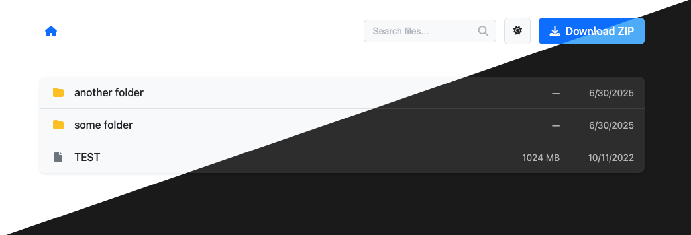

# serve-zip

> Simple HTTP server that streams directories as a ZIP

## Introduction

This server is a dependency for setting up a dead simple, modern file browser using nginx. There are two parts:

1. [autoindex.xslt](./autoindex.xslt), which renders HTML pages to navigate, preview, and download individual files
2. This server, which allows you to download entire directories as a ZIP file



## Usage

> **:warning: There is no form of authentication built into this project. It is left for you to set up!**

1. Run this server using the binary in releases or [Docker image](https://hub.docker.com/r/virb3/serve-zip). Run with `--help` to see all available configuration.

2. In your `/etc/nginx/nginx.conf`, add the following line at the top:

   ```nginx
   load_module modules/ngx_http_xslt_filter_module.so;
   ```

2. Drop [autoindex.xslt](./autoindex.xslt) in a path like: `/etc/nginx/static/autoindex.xslt`

3. Set up your file browser conf file, adjusting the server url, autoindex path, and root directory if necessary:

   ```nginx
   location @zip {
     proxy_pass http://serve-zip:8080;
   }
   error_page 418 = @zip;
   
   location / {
     if ($arg_zip) {
       return 418;
     }
     autoindex on;
     autoindex_format xml;
     autoindex_exact_size off;
     autoindex_localtime off;
     xslt_stylesheet /etc/nginx/static/autoindex.xslt;
     root /my-data/;
   }
   ```

## Credits

[autoindex.xslt](./autoindex.xslt) is a modified version of [Nginx-Autoindex](https://github.com/EvilVir/Nginx-Autoindex).

This server borrows some code from [gosses](https://github.com/ViRb3/gosses).
